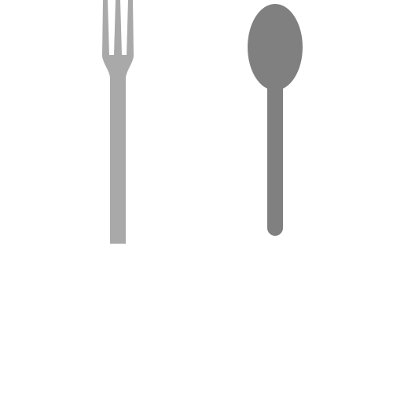

# image styles

recommended styling approaches:

- _width: 70%_
- _height: 16em_

images should **not** be sized via _vw_ / _vh_

# svgs

included svgs will not keep any attributes - these will be replaced by attributes from the svg source; therefore, a style cannot be specified on an svg directly; an alternative would be wrapping the svg in a figure and styling the figure

example:

```html
<figure style="width: 50%; margin: 0 auto">
  
</figure>
```

# line length for code

currently 60 (see sections/prettierrc.json)

could be up to 65
